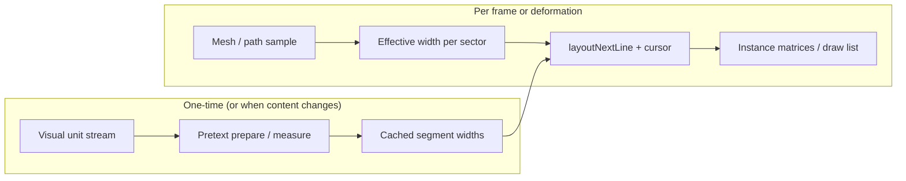

# Toposet

**Layout on geometry.** Toposet is a layout engine and experiment surface for packing visual units along bands and paths on 3D geometry—like line layout, but the “lines” are geodesics or contour strips on a mesh. Measurement is batched; the hot path stays arithmetic so surfaces can reflow when the shape, damage, or obstacles change.

The long-term goal is a **toolkit and editor workflow**: authors define a stream of measured units (glyphs, icons, instanced mesh “tiles,” abstract ornaments), map surface bands or paths to one-dimensional layout widths, and drive placement in **Three.js / WebGL** (or export rules for game engines). This repository is the **reference implementation and playground** for that idea.

---

## Table of contents

- [Why this exists](#why-this-exists)
- [How it works](#how-it-works)
- [What’s in this repo today](#whats-in-this-repo-today)
- [Quick start](#quick-start)
- [Project structure](#project-structure)
- [Architecture notes](#architecture-notes)
- [Roadmap](#roadmap)
- [Credits](#credits)

---

## Why this exists

Most real-time 3D decoration is **scatter, noise, or simulation**: things look organic but not *authored*. Typographic layout is the opposite: **deterministic packing** from measured widths, with predictable reflow when the available line width changes.

Toposet asks: *what if the “page” is a surface?*

- Each **contour band** or **path** is unrolled into an effective **line width** (arc length × scale, minus obstacles).
- A layout pass decides **which units fit** in each segment.
- **Instancing** (or custom renderers) place geometry along the path; when the mesh deforms or a “wound” shrinks local width, you **re-run layout** on cached measurements—no per-frame DOM text measurement.

That makes surfaces behave like **continuously re-typeset skin** rather than a static texture or a particle spray.

---

## How it works

At a high level:



1. **Prepare**  
   Build a string (or future API: token list) representing your units. [@chenglou/pretext](https://www.npmjs.com/package/@chenglou/pretext) segments and measures it (e.g. canvas `measureText`), producing **width tables** and break metadata.

2. **Parameterize the surface**  
   Choose how you get 1D “lines” on the mesh: iso-parameter curves, geodesic polylines, manually authored splines, etc. Each **sector** along a band has a scalar **maximum width** in layout space (usually proportional to arc length).

3. **Layout**  
   Walk the surface with a persistent **`LayoutCursor`**. For each sector, call `layoutNextLine(prepared, cursor, maxWidth)`, then advance `cursor` to `line.end`. Variable `maxWidth` is how you model **obstacles, damage, vents, or moving plates**—the same idea as line-by-line layout with changing available width.

4. **Project**  
   Map each laid-out unit to a position/orientation on the surface (Frenet-style frame from tangents and normals), update **instanced meshes** or GPU buffers.

The interactive demo uses a **deforming torus**, **multiple contour bands** (fixed \(v\), varying \(u\)), a **moving angular wound** that narrows `maxWidth`, and **instanced boxes** as stand-ins for arbitrary modules.

---

## What’s in this repo today

| Piece | Status |
|--------|--------|
| Pretext-backed ornamental stream + `prepareWithSegments` | Implemented (`src/skinText.ts`) |
| Per-band layout cursors + sector `layoutNextLine` | Implemented (`src/TopologySkin.tsx`) |
| Variable width / “wound” band + body deformation | Implemented (`src/App.tsx` + HUD) |
| React Three Fiber + Drei scene | Implemented |
| Standalone editor UI, export, game-engine plugins | Not yet—roadmap |

This is intentionally an **experiment surface**: the APIs are wired for clarity, not yet packaged as a versioned library.

---

## Quick start

**Requirements:** Node.js 20+ recommended.

```bash
npm install
npm run dev
```

Open the URL Vite prints (usually `http://localhost:5173`). Orbit the camera with the mouse; use the HUD sliders to change wound size, narrowing factor, and deformation.

**Production build:**

```bash
npm run build
npm run preview
```

---

## Project structure

```
├── index.html
├── vite.config.ts
├── package.json
└── src
    ├── main.tsx          # React entry
    ├── App.tsx           # Canvas, lighting, HUD controls
    ├── TopologySkin.tsx  # Torus bands, Pretext layout loop, instancing
    ├── skinText.ts       # Ornamental stream + prepare + cursor seeding
    └── style.css         # HUD + full-viewport layout
```

---

## Architecture notes

- **Pretext** owns **segmentation, measurement, and line breaking**; your code owns **geometry sampling and instance placement**. The layout hot path avoids DOM reads after prepare.
- **Cursor discipline:** each contour band in the demo keeps its own cursor so bands don’t all show the same phase of the stream; you can instead synchronize bands or drive multiple streams.
- **Placement vs. breaking:** the demo distributes glyphs **uniformly within a sector** along the arc for simplicity. A stricter pipeline would walk **per-segment widths** from the prepared handle so spacing matches Pretext’s metrics exactly.
- **Scaling:** `LAYOUT_PX_PER_WORLD` in `TopologySkin.tsx` maps world arc length to Pretext’s pixel widths—tune this relationship for your font size and scene scale.

---

## Roadmap

Possible next steps toward a real “engine + editor”:

- **Library boundary** — Core types (`SurfaceBand`, `LayoutSector`, `Placement`) and a small runtime package separate from the demo app.
- **Editor** — Author streams, preview meshes, paint obstacle masks or width curves on UVs, export JSON or code.
- **Geometry** — Tube curves / skinned meshes / imported glTF with UV-defined bands; optional geodesic approximation.
- **Rendering** — Multi-geometry instancing, texture atlases, or GPU buffer paths for very high instance counts.
- **Game integration** — Document a minimal C#/Unity or Godot story (width table export + native line walker, or WASM layout).

Contributions and experiments that explore new surface parameterizations are in scope.

---

## Credits

- **Layout and measurement:** [Pretext](https://www.npmjs.com/package/@chenglou/pretext) (`@chenglou/pretext`) by Cheng Lou.
- **Realtime 3D:** [Three.js](https://threejs.org/), [React Three Fiber](https://docs.pmnd.rs/react-three-fiber/getting-started/introduction), [Drei](https://github.com/pmndrs/drei).

---

## Name and repository

You may publish under a different GitHub repository name than the current npm package folder (`pretext-three-experiment`). **Toposet** is the product/engine name; rename the remote and `package.json` `"name"` when you are ready to ship.

If you add a **LICENSE** file before publishing, describe it here (MIT is common for libraries and demos).
