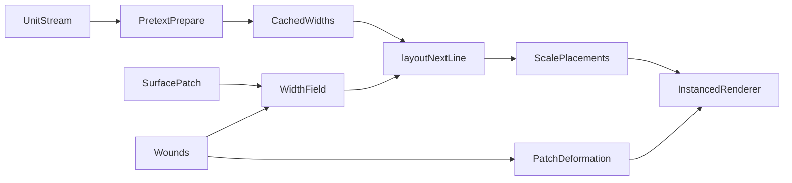

# Pretext Weft

Pretext Weft is a prototype **surface-layout engine** for games and interactive 3D. The flagship demo is a close-up fish-scale patch: click the skin, open a wound, and nearby scales **repack around the damage** instead of behaving like random scatter.

That is the core claim of the project:

- prepare a measured stream of units
- derive changing available width from geometry and damage
- run deterministic layout with Pretext
- project the result back onto the surface as geometry

This is not really about “text on a torus.” It is about using **layout as a runtime primitive for skin, ornament, and surface detail**.

## Why this matters

Most procedural surface detail in games comes from:

- hand placement
- baked textures
- decals
- noise / scatter
- one-off custom packing logic

Those can look good, but they do not behave like authored layout. They are often hard to reflow when the model bends, breaks, opens, or takes damage.

Pretext Weft takes a different approach:

- the surface is treated like a page
- bands and rows become lines
- wounds and obstacles become width constraints
- Pretext decides what fits
- the renderer places the chosen units back onto the model

So instead of “sprinkle meshes on a surface,” the system becomes “run a deterministic layout pass on a surface.”

## Why Pretext

[Pretext](https://www.npmjs.com/package/@chenglou/pretext) already gives the engine the hard 1D layout pieces:

- segmentation
- measurement
- deterministic line breaking
- fast reflow against changing widths

Pretext Weft uses that machinery as the **layout core** and maps it onto 3D geometry.

## The flagship demo

The current demo is a **fish-scale wound field**.

What it demonstrates:

- the scales are **ordered**, not randomly scattered
- clicking creates **persistent wounds**
- the patch **deforms physically**
- nearby scales **lift and repack**
- local damage changes the **available width field** that Pretext lays out against

This is meant to communicate the value proposition clearly:

**damage changes structure, not just shading**

## Architecture

The project is intentionally split so the engine idea does not depend on React:

- **React** is only used for the site shell and controls
- **Three.js + WebGPU** run the actual demo renderer
- **No React Three Fiber** is used in the runtime
- **Plain TypeScript** owns the scene, layout pass, click interaction, and rendering updates

That keeps the core direction portable to other runtimes and tools.

## Pipeline



1. **Prepare**  
   Build a unit stream and let Pretext measure it once.

2. **Sample the surface**  
   Turn the fish skin patch into rows and sectors with available width.

3. **Apply damage**  
   Clicking creates wounds that reduce local width and deform the patch.

4. **Layout**  
   Use stable seeded cursors and `layoutNextLine()` to generate placements from the damaged width field.

5. **Project and render**  
   Convert the placements into instanced scales with position, orientation, color, and lift.

## Quick start

Requirements: Node.js 20+ recommended.

```bash
npm install
npm run dev
```

Open the Vite URL in a **WebGPU-capable** browser.

Important:

- the playground is **WebGPU only**
- Three.js WebGL fallback is disabled
- if WebGPU is unavailable, the demo should fail instead of silently switching APIs

Build for production:

```bash
npm run build
npm run preview
```

## Project structure

```text
src/
  App.tsx                     React shell
  Landing.tsx                 Product framing
  Editor.tsx                  Controls + runtime host
  skinText.ts                 Pretext stream preparation and seeded cursors
  createWebGPURenderer.ts     WebGPU-only renderer bootstrap
  playground/
    PlaygroundRuntime.ts      Plain Three.js/WebGPU runtime
    fishScaleSample.ts        Flagship demo logic
    types.ts                  Runtime parameter types
  samples/
    sampleMeta.ts             UI copy for the flagship demo
    graphemes.ts              Shared grapheme helper
```

## What this is not yet

- not a packaged engine
- not a full editor workflow
- not a generalized authoring tool for all surface types
- not yet integrated with external game engines

Right now this repo is a **reference prototype** designed to prove the idea in the clearest possible way.

## Next steps

- extract a renderer-agnostic `core` package
- define generic placement/output data structures
- support more surface parameterizations than the fish patch
- add authoring tools for width masks, paths, and stream design
- explore export/runtime stories for game engines

## Credits

- Layout and measurement: [Pretext](https://www.npmjs.com/package/@chenglou/pretext)
- Rendering: [Three.js](https://threejs.org/)

## License

[MIT](LICENSE)
