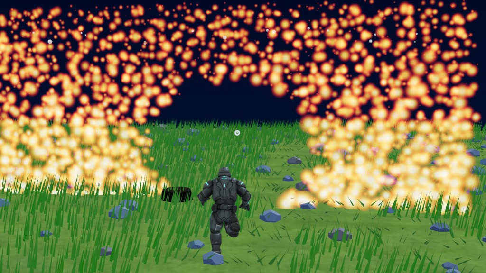

# Pretext Weft

Pretext Weft is a prototype surface-layout engine for interactive 3D. Instead of scattering meshes with noise and then layering separate gameplay logic on top, it treats a surface like a page: Pretext measures a glyph stream, breaks it into rows and sectors, and the renderer projects the result back into the world.



The current site has two faces:

- `Overview`: explains the engine argument and compares it to traditional scatter workflows
- `Playground`: a live WebGPU scene where multiple surface types share the same layout driver

## Core idea

The landing page is the current product thesis in one sentence:

**typography as a 3D placement engine**

Instead of hand-tuning density, spacing, and variation per effect, this project uses typographic line breaking as the common placement primitive. A surface only needs:

- a glyph vocabulary, or a weighted semantic palette with ids and metadata
- a projection that turns laid-out rows and sectors into world-space instances

Gameplay response then becomes a width problem. Narrow a slot, and fewer glyphs fit. Return zero width, and that part of the surface disappears. Some samples use direct width changes; others keep layout stable and apply deterministic thinning on top.

## Current playground

The current `Editor` is no longer a single fish demo. It hosts one shared runtime scene with controls for:

- grass field: trampling, disturbance radius, wind, seasonal palette, density, recovery
- fish wall: wound radius, retained width, crater depth, scale lift, surface flex, recovery
- rock field: layout density and overall rock scale
- fire wall: bullet-hole size and recovery
- star sky: density and sky-wound recovery
- scene actions: clear grass, fish wall, fire, sky, or everything at once

All of those surfaces are mounted together inside one plain TypeScript `PlaygroundRuntime`, not separate React demos.

## Runtime interaction

In the current playground:

- `W`, `A`, `S`, `D` move
- `Shift` sprints
- `Space` jumps
- right mouse drag looks around
- mouse wheel zooms
- left click shoots the reticle target

Shots affect the world based on what is under the reticle:

- grass gets local disturbance
- the fish wall gets persistent wounds
- the fire wall gets punched holes
- the sky can be wounded when you shoot upward past world geometry

## How it is built

The architecture is intentionally split so the engine idea is not coupled to React:

- React is only the site shell, landing page, and control UI
- `Three.js` + `WebGPU` run the renderer
- the render path is plain TypeScript, with no React Three Fiber
- Pretext provides measurement and deterministic line breaking

At a high level the pipeline is:

1. Prepare a measured glyph stream with Pretext.
2. Describe a surface as rows, sectors, and available width.
3. Run deterministic layout with seeded cursors.
4. Project laid-out glyphs into world-space instances.
5. Re-run layout or thinning when gameplay changes the width field.

## Quick start

Node.js 20+ is recommended.

```bash
npm install
npm run dev
```

Then open the Vite URL in a **WebGPU-capable browser**.

Important:

- this playground is WebGPU-only
- Three.js WebGL fallback is intentionally disabled
- if WebGPU is unavailable, the app should fail clearly instead of silently switching renderers

Production build:

```bash
npm run build
npm run preview
```

## Project structure

```text
src/
  App.tsx                     Site shell with Overview / Playground navigation
  Landing.tsx                 Product framing and engine explanation
  Editor.tsx                  Playground controls and runtime host
  skinText.ts                 Surface text preparation and seeded cursors
  createWebGPURenderer.ts     WebGPU-only renderer bootstrap
  playground/
    PlaygroundRuntime.ts      Shared world runtime and interaction loop
    grassFieldSample.ts       Ground-cover layout and disturbance response
    fishScaleSample.ts        Wounded fish-wall surface
    rockFieldSample.ts        Rock placement sample
    fireParticleSample.ts     Shootable fire wall with recovering holes
    starSkySample.ts          Sky layout and wound response
    types.ts                  Runtime parameter types and defaults
```

## What this repo is

- a reference prototype for layout-driven surface placement
- a playground for comparing multiple surface types under one API
- a proof that gameplay-driven density can come from layout instead of scatter rebuilds

## What it is not yet

- not a packaged engine
- not a polished editor workflow
- not a generalized content pipeline for every surface type
- not yet integrated into an external game engine

## Credits

- Layout and measurement: [Pretext](https://www.npmjs.com/package/@chenglou/pretext)
- Rendering: [Three.js](https://threejs.org/)

## License

[MIT](LICENSE)
